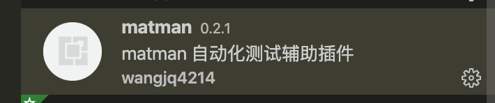

# Contributing


## 学习资料

- [Testing Extensions](https://code.visualstudio.com/api/working-with-extensions/testing-extension)
- [Publishing Extensions](https://code.visualstudio.com/api/working-with-extensions/publishing-extension)
- [VScode 插件开发（六）打包发布](https://juejin.im/post/6844903945341501448)

## 编译安装

1. 克隆本仓库，运行下面的命令，得到 `matman-0.2.1.vsix` 文件：

```bash
$ npm install

$ npm run package
```

2. 打开 VSCode，点击左边栏 `extension` 项，点击边栏右上角三点，选择 `Install from VSIX`，选择刚才编译好的 `matman-0.2.1.vsix` 文件。
3. 重新启动 VSCode 后，若 extension 中有 matman 项，则说明安装成功。



## 发布

```
$ vsce publish
```