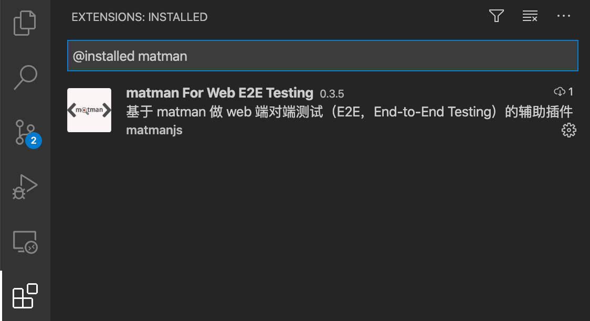

# matman for web 端对端测试（E2E，End-to-End Testing）

本插件为基于 [matman](https://matmanjs.github.io/matman/) 做 web 端对端测试（E2E，End-to-End Testing）的辅助插件，功能包含：

- 代码片段补齐(code snippets)，支持 `mocha`、`chai`、`matman`、`mockstar` 等框架常见场景
- 代码覆盖率染色查看，支持合并计算多个 `lcov.info` 文件的全量覆盖率和增量覆盖率
- 支持直接执行 `.js` 和 `.ts` 文件

> [matman](https://matmanjs.github.io/matman/) 是一个可用于做 web 端对端测试（E2E，End-to-End Testing）的框架，十分适合 web 前端开发人员来编写端对端测试。

## 1. 安装插件

本插件已经发布到插件商店（[地址](https://marketplace.visualstudio.com/items?itemName=matmanjs.matman)），因此可以直接在 VSCode 的 `Extensions` 中搜索 `matman` ，点击安装(`Install`) 即可。

注意，安装完成之后，需要重启 VSCode，可以在 `Extensions` 中查看状况，如有，则说明安装成功。

## 2. 使用插件

### 2.1 代码覆盖率染色查看

`command(ctrl)+shift+P` 打开 VSCode 的命令面板，输入 `matman`，可以看到如下命令：

- 仅支持 `lcov.info` 覆盖率文件
- 不支持多个工作区
- 代码覆盖率染色时，左侧文件树无法区别是否有覆盖，待优化

#### 2.1.1 显示全量覆盖率

选择 `matman: Show FullCoverage（显示全量覆盖率）`，接下来会需要选择哪些 `lcov.info` 文件。支持多选！支持多选！支持多选！如果选择多个 `lcov.info` 文件，会自动进行合并。

运行之后在 VSCode 左下角状态栏有覆盖率数值：

当你打开文件时，也可以看到代码有染色，其中绿色代表已覆盖，红色代表未覆盖：

也有可能本项目中不存在 `lcov.info` 文件，那么请先运行自动化测试生成该文件，此时 VSCode 右下角会进行错误提示。

#### 2.1.2 隐藏全量覆盖率

选择 `matman: Hide FullCoverage（隐藏全量覆盖率）` 即可以取消全量覆盖率时的代码染色。

#### 2.1.3 显示增量覆盖率

选择 `matman: Show IncrementCoverage（显示增量覆盖率）`，接下来会需要选择哪些 `lcov.info` 文件。支持多选！支持多选！支持多选！如果选择多个 `lcov.info` 文件，会自动进行合并。

运行之后在 VSCode 左下角状态栏有覆盖率数值：

当你打开文件时，也可以看到代码有染色，其中绿色代表已覆盖，红色代表未覆盖。

#### 2.1.4 隐藏增量覆盖率

选择 `matman: Hide IncrementCoverage（隐藏增量覆盖率）` 即可以取消增量覆盖率时的代码染色。

### 2.2 执行 js 或 ts 文件

在 TS 或者 JS 文件中点击右键，可以看到：

可以方便的执行当前文件。

### 2.3 代码片段补齐(code snippets)

支持 `mocha`、`chai`、`matman`、`mockstar` 等框架常见场景.

#### 2.3.1 matman.code-snippets

| 指令                    | 描述                                                                                 |
| ----------------------- | ------------------------------------------------------------------------------------ |
| `m-matman-case-v0`      | matman case modules 模板 v0，单文件形式                                              |
| `m-matman-case-v1`      | matman case modules 模板 v1，使用 helpers 工厂模式创建 PageDriver                    |
| `m-matman-case-v2`      | matman case modules 模板 v2，使用 helpers 工厂模式创建 PageDriver，使用 env 定义常量 |
| `m-matman-helper-init`  | matman helper 模板                                                                   |
| `m-matman-case-action`  | matman case module 增加 addAction                                                    |
| `m-matman-case-debug`   | matman case module 增加 debug 代码                                                   |
| `m-matman-crawler-init` | matman crawler 爬虫脚本模板                                                          |
| `m-matman-config-init`  | matman.config.js 模板                                                                |

#### 2.3.2 mocha.code-snippets

| 指令                   | 描述                    |
| ---------------------- | ----------------------- |
| `m-mocha-describe`     | mocha 新建 describe     |
| `m-mocha-it`           | mocha 新建 it           |
| `m-mocha-e2e-tpl`      | mocha e2e 新建测试文件  |
| `m-mocha-e2e-describe` | mocha e2e 新建 describe |

#### 2.3.3 chai.code-snippets

| 指令                      | 描述                                 |
| ------------------------- | ------------------------------------ |
| `m-chai-s-type`           | 是否为 string 类型                   |
| `m-chai-s-equal`          | string 是否相等                      |
| `m-chai-s-not-equal`      | string 是否不相等                    |
| `m-chai-s-length`         | string 的长度                        |
| `m-chai-n-type`           | 是否为 number 类型                   |
| `m-chai-n-equal`          | number 是否相等                      |
| `m-chai-n-not-equal`      | number 是否不相等                    |
| `m-chai-n-above`          | number 是否大于某个数                |
| `m-chai-n-at-least`       | number 是否大于或等于某个数          |
| `m-chai-array-type`       | 是否为 array 类型                    |
| `m-chai-array-eql`        | array 是否相等                       |
| `m-chai-array-not-eql`    | array 是否不相等                     |
| `m-chai-array-include`    | array 是否包含某个元素               |
| `m-chai-array-length`     | array 的元素个数                     |
| `m-chai-o-type`           | 是否为 object 类型                   |
| `m-chai-o-eql`            | object 是否相等                      |
| `m-chai-o-not-eql`        | object 是否不相等                    |
| `m-chai-o-have-property`  | object 包含某个属性                  |
| `m-chai-o-have-and-equal` | object 包含某个属性且值等于指定值    |
| `m-chai-is-undefined`     | 是否为 undefined                     |
| `m-chai-is-null`          | 是否为 null                          |
| `m-chai-is-true`          | 是否为 true                          |
| `m-chai-is-empty`         | 是否为 empty（[]、''、{}都算 empty） |

#### 2.3.4 dwt.code-snippets

| 指令             | 描述              |
| ---------------- | ----------------- |
| `m-dwt-testbase` | DWT testBase 注解 |

## 3. Known Issues

欢迎大家提交 [issue](https://github.com/matmanjs/matman-vscode-extensions/issues/new)。
